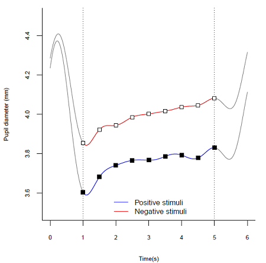

# PupilAnalysis (Under construction)

PupilAnalysis is a code developed in the R platform for pupil signal processing.
This code requires a database (.csv), which in our research was obtained through an eye tracking device (Tobii TX300).

This code shows how to do:  
- Loading original database;
- Filter to extract only the signal of interest;
- Function to extract interval of interest;
- Signal Loss Analysis;
- **Pre-processing**;
- Variance Analysis;
- Statistical significance teste;
- Average curve of the pupil sign.

In addition, after pre-processing step, the [PCA and MLDA](https://github.com/IPL-FEI/SiProcess) can be used for feature extraction.

## Coming soon
- PCA and MLDA direct in R;
- Crossing rate by zero;
- Signal energy.

## Pre-processing

In this step is done the reconstruction of the missing data intervals.  
Example of missing data by blink of an eye:  

Step 1: Location of missing data intervals.  

Removal of outliers and preservation of the positions of the data.  

Step 2: Data interpolation.  

Step 3: Smoothing for remove noise.  

Example with 220 seconds of recording. Signal before and after pre-processing.  

## Variance Analysis

## Statistical significance teste

## Average curve of the pupil sign

